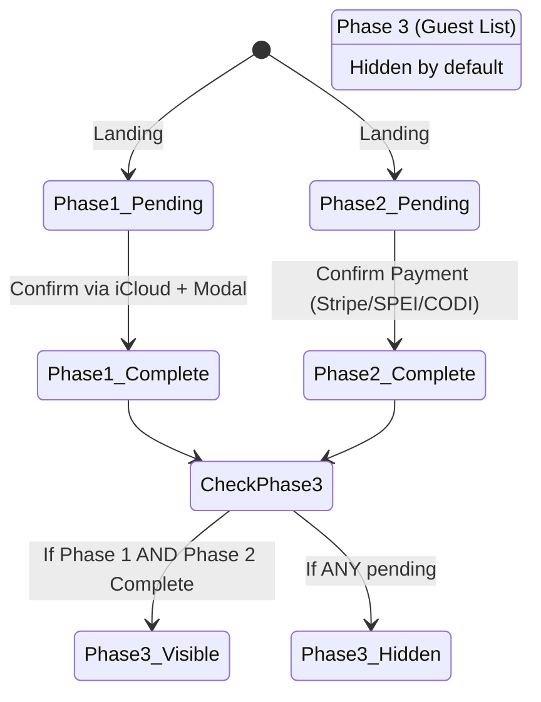
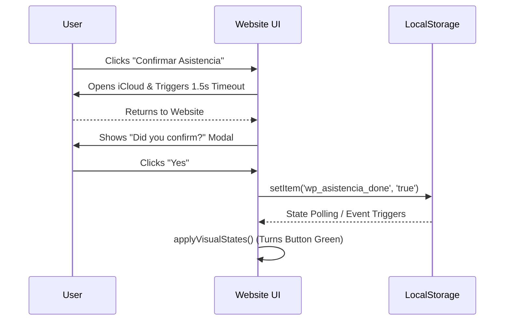

# Software Requirements Specification (SRS)
## Welcome Party: Ricardo Sierra

**Version:** 1.0.0
**Date:** August 2026
**Prepared by:** Software Architect
**Status:** Approved

---

## 1. Introduction

### 1.1 Purpose
This Software Requirements Specification (SRS) document outlines the complete functional and non-functional requirements for the "Welcome Party" static web application. It is intended to serve as a formal guide for developers, designers, and stakeholders to understand, maintain, and recreate the system architecture, design patterns, and user flows.

### 1.2 Document Conventions
This document adheres to the IEEE 830-1998 standard for SRS documentation. Important terms and system states are bolded. User flows and state machines are represented using Mermaid diagrams.

### 1.3 Project Scope
The "Welcome Party" application is a highly interactive, single-page static website built to manage event RSVPs and collect monetary contributions (Phase 1 and Phase 2) for a welcome party. The system utilizes local storage for state management and features advanced CSS/JS animations (glassmorphism, parallax, physics-based dragging) to provide a premium user experience.

---

## 2. Overall Description

### 2.1 Product Perspective
The system operates entirely client-side as a static HTML/CSS/JS application. It does not require a backend database; instead, it relies on `localStorage` to persist the user's progress across the three main phases of the application. External integrations are limited to redirection links (iCloud for calendar/RSVP, Stripe for payments).

### 2.2 Product Functions
- **Hero Interaction:** A physics-based draggable card with "liquid glass" visual distortion and background gradient syncing.
- **Progressive Disclosure:** A 3-phase flow where Phase 3 (Confirmed Guest List) is strictly hidden until Phase 1 (Attendance) and Phase 2 (Payment) are completed.
- **State Management:** Real-time UI updates (polling and event listeners) that keep the interface synchronized with `localStorage`.
- **Payment Modals:** Custom modal overlays for multiple payment methods (Stripe, SPEI, CODI).

### 2.3 User Flow and State Diagram

---

## 3. External Interface Requirements

### 3.1 User Interfaces
- **Aesthetic:** Dark mode by default, utilizing a "Glassmorphism" design system (frosted glass, blurred backgrounds, dynamic gradients).
- **Responsive:** Mobile-first design adapting up to 520px max-width container.
- **Color Coding:**
  - Pending States: Red / Warnings (`rgba(220, 38, 38, 0.2)`).
  - Completed States: Green / Success (`#22c55e`).

### 3.2 Software Interfaces
- **iCloud:** Used for calendar event sharing and RSVP.
- **Stripe:** Used for processing secure credit card payments.

---

## 4. System Features

### 4.1 Advanced Hero Physics (Fidget Spinner / Liquid Glass)
**Description:** The main hero card is interactive. Users can click/touch and drag the card around the screen.
**Behavior:**
- **Drag & Skew:** Velocity-based calculations apply `scale` and `skew` transforms mimicking a liquid glass stretching effect.
- **Gradient Tracking:** The radial background gradient dynamically increases opacity and tracks the card's movement.
- **Elastic Snap-back:** On release (`mouseup`/`touchend`), the card snaps back to its origin using a `cubic-bezier` spring transition.

### 4.2 Two-Tier Confirmation (Progressive Disclosure)
**Description:** The core logic gate of the application.
**Behavior:**
- **Phase 1 (Attendance):** User clicks the confirm button, redirects to iCloud, returns, and validates via a modal. State is saved as `wp_asistencia_done = true`.
- **Phase 2 (Payment):** Unlocked by default. User selects Stripe, SPEI, or CODI. After a delay, a modal verifies payment. State is saved as `wp_pago_done = true`.
- **Phase 3 (Confirmed Guests):** A dynamically rendered list of guests. Only visible when `wp_asistencia_done == true` AND `wp_pago_done == true`.

### 4.3 Real-Time State Synchronization
**Description:** The application must update instantly without manual refreshes.
**Behavior:**
- A `setInterval` polling mechanism runs every 1000ms checking `localStorage`.
- If a delta is detected between the current and previous state, `applyVisualStates()` and `updateProgressSection()` are invoked instantly.

---

## 5. Nonfunctional Requirements

### 5.1 Performance Requirements
- **60 FPS Animations:** All drag physics and glassmorphism hover effects must use hardware-accelerated CSS properties (`transform`, `opacity`) to ensure smooth 60fps rendering on mobile devices.
- **Zero Layout Thrashing:** DOM reads (`getBoundingClientRect`) and writes (`style.transform`) during the `mousemove` loop must be batched or highly optimized.

### 5.2 Reliability & Usability
- The system must function even if the user switches tabs or browsers (handled via `localStorage` persistence).
- Modals must be easily dismissible and not lock the main thread.

---
**End of Document**
